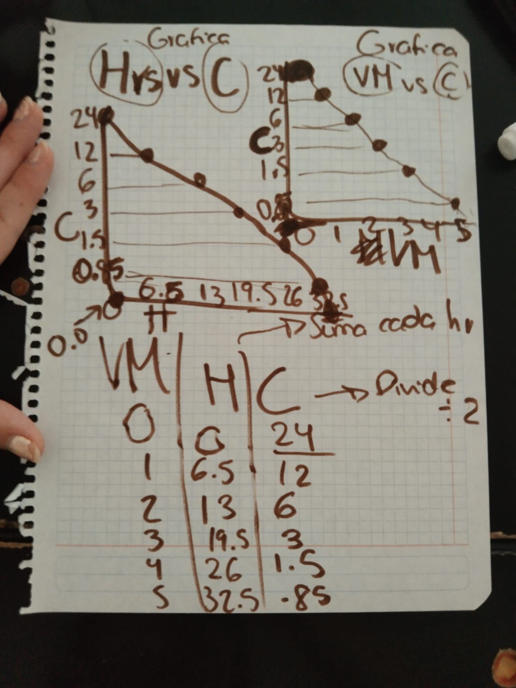

## FarmaPlot ##

📖 Descripción
    Este proyecto es una herramienta web interactiva inspirada en las necesidades de los estudiantes de medicina y farmacología. Permite a los usuarios calcular y visualizar cómo la concentración de un fármaco disminuye en el cuerpo a lo largo del tiempo, basándose en el concepto de la vida media.

El usuario introduce una concentración inicial y la vida media del fármaco, y la aplicación genera una tabla detallada y un gráfico que ilustran el decaimiento exponencial.

✨ Funcionalidades (Features)
    Entrada de Datos Sencilla: Pide al usuario dos valores clave:
    - Concentración inicial del fármaco (en μg)
    - Vida media inicial del fármaco (en horas).
    
    Generación de Tabla Dinámica: Crea automáticamente una tabla con los siguientes datos:

    - Vida Media: El número de vidas medias transcurridas (0, 1, 2, 3...).
    - Tiempo (H): El tiempo total acumulado en horas.
    - Concentración (C): La concentración restante del fármaco.

El cálculo continúa hasta que la concentración llega a un umbral mínimo predefinido (cercano a cero).

Visualización Gráfica: (Funcionalidad futura)
    Genera un gráfico que representa la curva de decaimiento de la concentración contra el tiempo.

🚀 Cómo Utilizar
    - Abre el archivo index.html en tu navegador web.
    - Introduce la concentración inicial en el campo correspondiente.
    - Introduce la vida media en horas.
    - Haz clic en el botón "Generar Tabla".
    - La tabla aparecerá en la parte inferior con los datos calculados.

    Para realizar un nuevo cálculo, simplemente vuelve a hacer clic en el botón e ingresa todos los datos nuevamente.

💻 Tecnologías Utilizadas
    -> HTML5: Para la estructura básica de la página.
    -> CSS3: Para dar estilo y hacer la interfaz amigable.
    -> JavaScript (Vanilla): Para toda la lógica de cálculo, manipulación del DOM y manejo de eventos.

📝 Futuras Mejoras
    [ ] Añadir espacios en blanco en la tabla cuando H no se ingresa.
    [ ] Permitir al usuario exportar la tabla a formatos como CSV o PDF.

## FarmaPlot Análisis de requerimientos (Requeriments)
this is a project inspired by a medicine student that needed to graph the half-life of drug from a table

What the project need to do?

-Ask for the concentration 
-Create table based on the rows needed, it is calculated by dividing by 2, until it reaches 0 
-The columns will be VM(vida media 'half-life'), H(hours),C (concentration)  
-Plot the graph
-show the graph

https://www.chartjs -  library used
